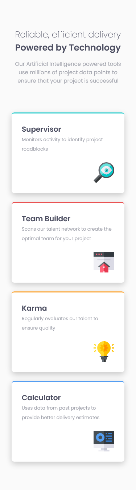
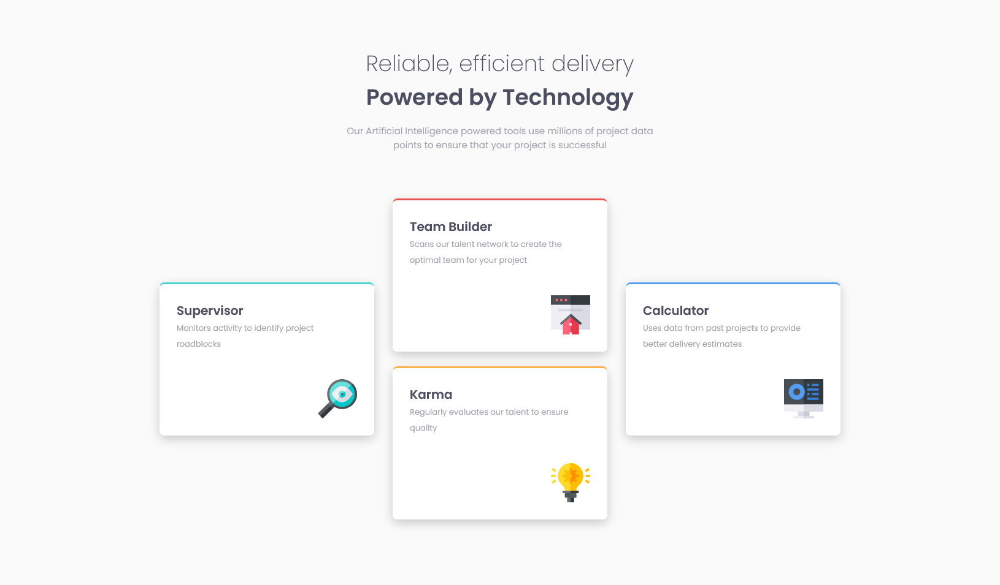

# Frontend Mentor - Four card feature section solution

This is a solution to the [Four card feature section challenge on Frontend Mentor](https://www.frontendmentor.io/challenges/four-card-feature-section-weK1eFYK). Frontend Mentor challenges help you improve your coding skills by building realistic projects.

## Table of contents

- [Overview](#overview)
  - [The challenge](#the-challenge)
  - [Screenshot](#screenshot)
  - [Links](#links)
- [My process](#my-process)
  - [Built with](#built-with)
  - [What I learned](#what-i-learned)
- [Author](#author)

## Overview

### The challenge

Users should be able to:

- View the optimal layout for the site depending on their device's screen size

### Screenshot

## Mobile

## Desktop

### Links

- Solution URL: [https://www.frontendmentor.io/challenges/four-card-feature-section-weK1eFYK/hub/four-card-feature-section-JmYAkfppg](https://www.frontendmentor.io/challenges/four-card-feature-section-weK1eFYK/hub/four-card-feature-section-JmYAkfppg)
- Live Site URL: [https://lumensum.github.io/FEM-four-card-feature-section/](https://lumensum.github.io/FEM-four-card-feature-section/)

## My process

### Built with

- HTML
- CSS
- Flexbox
- Mobile-first workflow

### What I learned

I tried making the Mobile version first and after that adjusting the stuff for Desktop.

## Author

- Frontend Mentor - [@royschrauwen](https://www.frontendmentor.io/profile/royschrauwen)
- Twitter - [@royschrauwen](https://www.twitter.com/royschrauwen)
